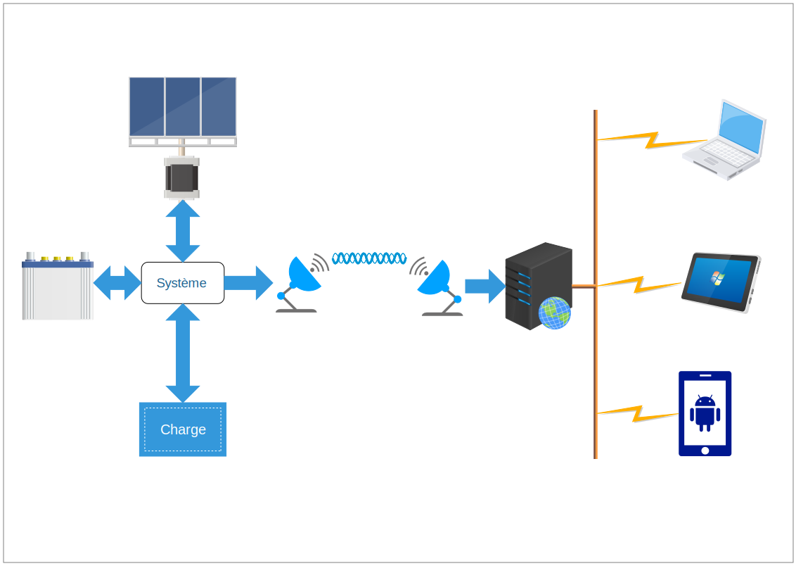

# Documentation du Projet Elec ITII-P17

**__Nota :__** Ce dépôt génère un site web accessible à l'adresse [https://itii-p17-projet-elec.github.io/documentation/](https://itii-p17-projet-elec.github.io/documentation/)

Ce dépôt contient la documentation du projet d'électronique de deuxième année de la formation ITII-EII-P17.

L'objectif de ce projet est de réaliser un système gérant l’exploitation d'accumulateurs en milieu isolé.
Le système a comme principaux objectifs de :
+ Charger une batterie d’accumulateurs à partir d’un panneau solaire en pilotant en azimut la position de ce dernier pour en optimiser le rendement ;
+ Superviser l’exploitation de la batterie (protection en cas de décharge excessive ou de consommation trop importante de la charge qui lui est reliée) ;
+ Transmettre les informations résultant de la supervision (charge, consommation, …) par un réseau sans fils et en permettre l’affichage sur PC/tablette/téléphone.

