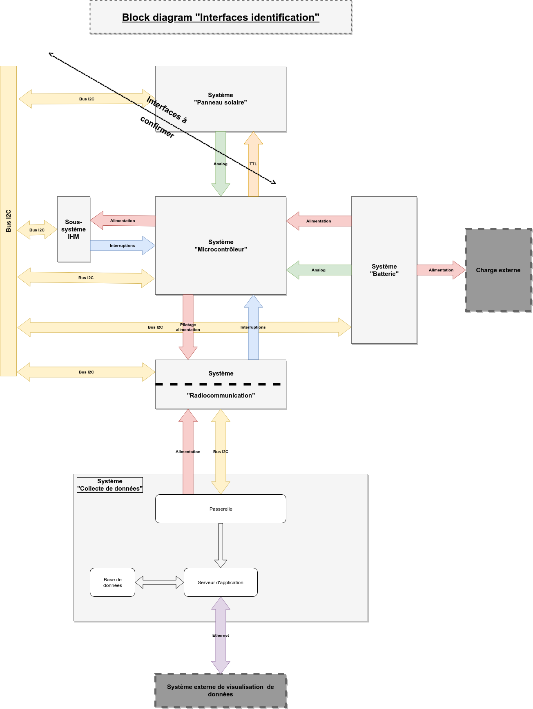

# Documentation des interfaces

## Schéma global d'identification des interfaces

Le schéma ci-dessous présente les différentes interfaces entre les systèmes :

## Liste des documents d'interface

+ [Interfaces entre le S. Batterie et le S. Microcontrôleur](interface-batterie_microcontroleur/)
+ [Interfaces entre le S. Microcontrôleur et le S. Radiocomm](interface-microcontroleur_radiocomm/index.md)

