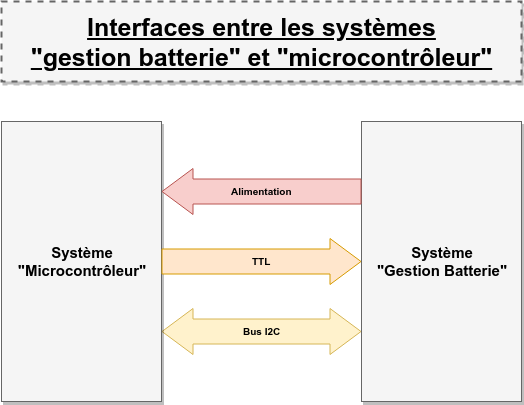

# Description des interfaces entre S. "Gestion batterie" et S. "Microcontrôleur"

## Identification

Ce document décrit l'interface située entre le système "Batterie" et le système "microcontrôleur".

Le système "Batterie" est en charge de la batterie d'accumulateurs. Il gère la
charge de ces derniers à partir de l'électricité générée par le système
"panneau solaire". Il fournit également des tensions régulées pour
l'alimentation des différents systèmes embarqués et la charge externe.

Les différents documents ci-après décrivent les interfaces entre le système
"gestion batterie" et le système "microcontrôleur".

## Identification des différents canaux de communication

Les différents types de "canaux" entre les deux systèmes sont schématisés dans le diagramme ci-dessous :

Les canaux de communication suivants ont été identifiés :

| Identifiant | Nom | Documentation | Description |
| --:|:-- | :--: | :-- |
|         | **Alimentation**  | [doc interface](alimentation.md)     | Tensions stabilisées permettant d'alimenter le S. microcontrôleur. |
|         | **TTL**           | ADU                                  | Interface logique ("digital output" du microcontrôleur) permettant de piloter certains éléments du système batterie (forcer la deconnexion de la charge par exemple). |
|         | **I2C**           |                                      | Bus de données permettant au S. Microcontrôleur de récupérer les mesures de grandeurs physiques au travers de convertisseurs analogique/numérique. |

# Spécifications matérielles

## Interconnexion

**TODO**

# Spécifications fonctionnelles

**TODO**
