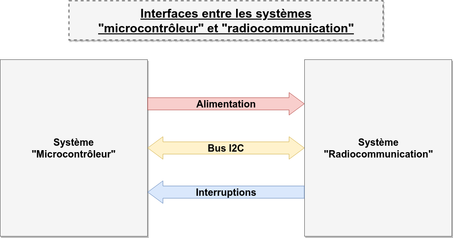

# Introduction

## Identification

Ce document décrit l'interface située entre le système "Radio-communication" et le système "microcontrôleur".

## Description du système

TODO

Le système "microcntrôleur" s'interface avec le système "collecte des mesures" au travers du système "radiocommunication".

Les différents documents ci-après décrivent les interfaces entre le système "microcontrôleur" et le système "radiocommunication".

## Description du document

TODO

## Identification des différents canaux de communication

Les différents types de "canaux" entre les deux systèmes sont schématisés dans le diagramme ci-dessous :

Les canaux de communication suivants ont été identifiés :

| Identifiant | Nom | Documentation | Description |
| --:|:-- | :--: | :-- |
| | **Pilotage alimentation** | [doc interface](pilotage_alim.md) | Signal permettant d'activer l'interface RF qu'en cas de besoin de transmission. |
| | **Données** | | Interface permettant d'échanger des données avec l'interface RF. |
| | **Interruption** | | Signal émis par le système Radiocomm pour prévenir le système microcontrôleur d'un évènement (reception de données par exemple). |

# Spécifications matérielles

## Interconnexion

L'interconnexion des deux systèmes se fera au moyen d'un 

# Spécifications fonctionnelles

